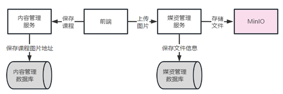
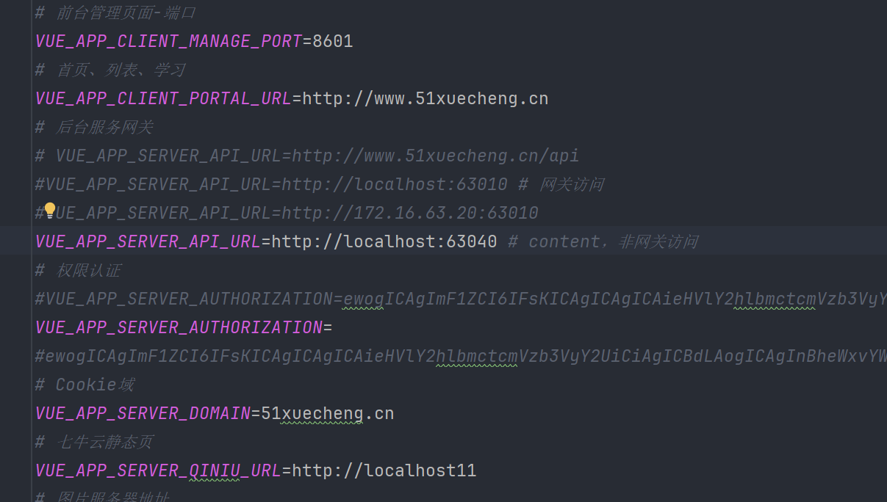
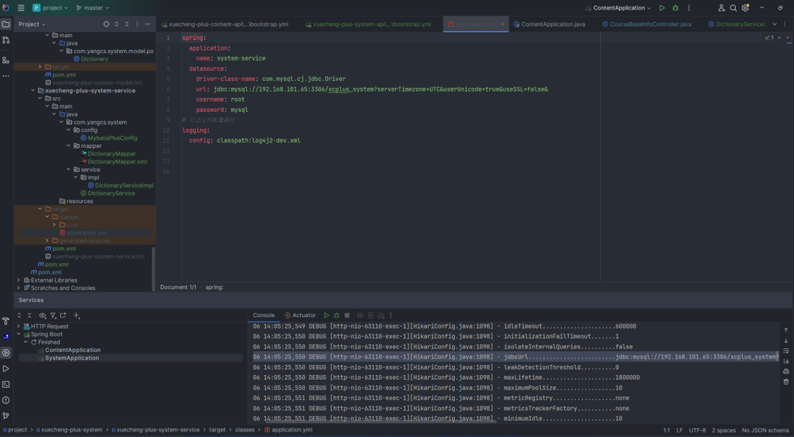
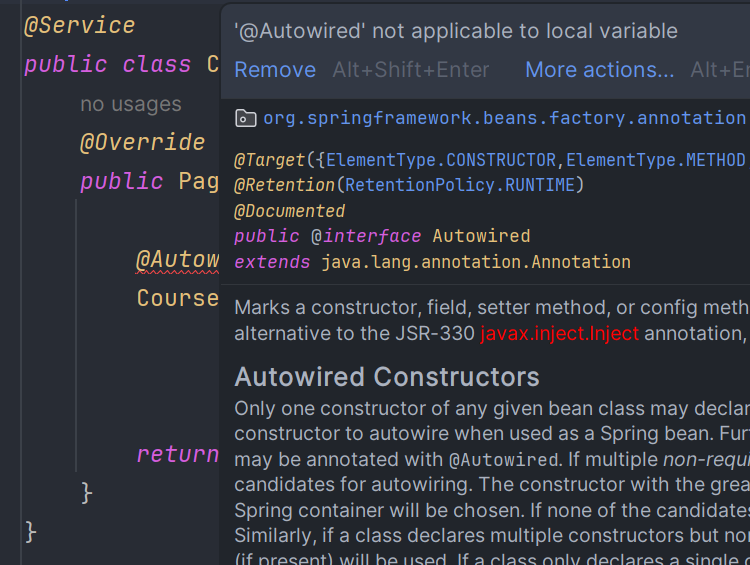

这是一个在线学习平台网站的项目
## 项目模块
### 媒资管理模块
上传课程图片整体包括两部分：
1. 上传课程图片，前端请求媒资管理服务将文件上传至分布式文件系统minio， 并且在媒资管理数据库保存文件信息；
2. 上传图片成功，保存图片地址到课程基本信息表中。

详细流程如下：

1. 前端进入上传图片界面；
2. 上传图片，请求媒资管理服务；
3. 媒资管理服务将图片文件保存到MinIo；
4. 媒资管理记录文件信息到数据库；
5. 前端请求内容管理服务，保存课程信息，在内容管理数据库保存图片地址。

<h2>记录bug：</h2>
<h3>1、困扰我时间最长的Bug</h3>
后端访问前端数据一直报404错误，反复检查代码都没有问题，做了很多尝试包括修改配置文件、仔细检查接口、检查po实体类、修改前端配置等，
找了好多天都没有找出来这个错误，最后发现有遇到相同问题的，尝试使用他的解决方法，把前端env文件配置行后面的注释去掉，终于解决了问题！

<h3>2、数据库报错</h3>
报错不明显，只显示了是数据库的连接错误，尝试修改数据库配置，确保没有问题，还是出错，采用debug模式的日志输出，发现数据库的配置ip发生了变化，
问题出在target文件夹里保留了之前运行的信息，默认使用target里面的配置，maven clean掉旧的配置，就可以解决问题了。

<h3>3、Bean注入</h3>
Bean进行Autowired注入的时候，不能在方法内部作为局部变量注入，要在方法外面进行注入

# a 